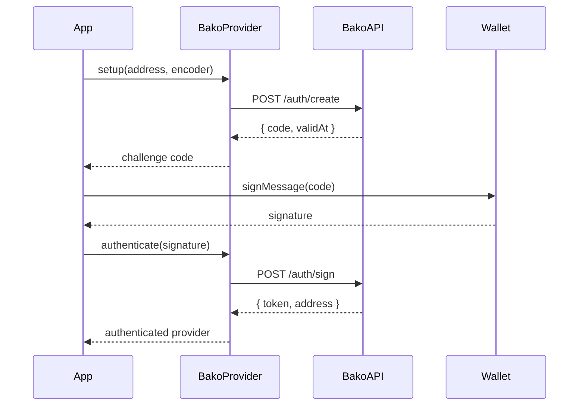

# Authentication Overview

Bako Safe SDK supports multiple authentication methods to accommodate different use cases and wallet types.

## Supported Authentication Types

| Type | Enum Value | Use Case |
|------|------------|----------|
| **Fuel Wallet** | `TypeUser.FUEL` | Native Fuel wallets (Fuel Wallet, Fuelet) |
| **WebAuthn** | `TypeUser.WEB_AUTHN` | Passkey-based authentication (biometrics) |
| **EVM Wallet** | `TypeUser.EVM` | Ethereum wallets (MetaMask, etc.) |
| **API Token** | N/A | CLI and programmatic access |

## Authentication Flow

All authentication methods (except API Token) follow a challenge-response pattern:



## TypeUser Enum

```typescript
enum TypeUser {
  FUEL = 'FUEL',
  WEB_AUTHN = 'WEB_AUTHN',
  EVM = 'EVM',
  SOCIAL = 'SOCIAL'
}
```

## Choosing an Authentication Method

| Scenario | Recommended Method |
|----------|-------------------|
| Browser dApp with Fuel Wallet | `FUEL` |
| Browser dApp with MetaMask | `EVM` |
| Passwordless authentication | `WEB_AUTHN` |
| CLI tools / Scripts | API Token |
| CI/CD pipelines | API Token |
| Server-side applications | API Token |

## Common Authentication Code

All interactive methods use `BakoProvider.setup()` and `BakoProvider.authenticate()`:

```typescript
import { BakoProvider, TypeUser } from 'bakosafe';

// Step 1: Generate challenge
const { code } = await BakoProvider.setup({
  address: walletAddress,
  provider: 'https://mainnet.fuel.network/v1/graphql',
  encoder: TypeUser.FUEL // or WEB_AUTHN, EVM
});

// Step 2: Sign with wallet (method varies by wallet type)
const signature = await signWithWallet(code);

// Step 3: Complete authentication
const provider = await BakoProvider.authenticate({
  challenge: code,
  signature,
  encoder: TypeUser.FUEL,
  address: walletAddress,
  serverUrl: 'https://api.bako.global'
});
```

## Next Steps

- [Fuel Wallet Authentication](/sdk/authentication/fuel-wallet)
- [WebAuthn Authentication](/sdk/authentication/webauthn)
- [EVM Wallet Authentication](/sdk/authentication/evm-wallet)
- [CLI & API Token](/sdk/cli/overview)
