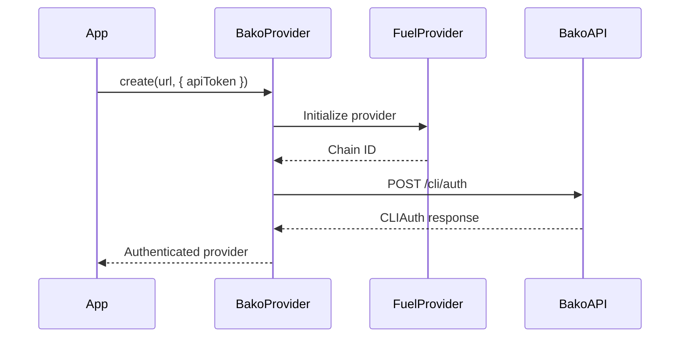

# CLI Authentication

Technical details of API token authentication in the Bako Safe SDK.

## Authentication Flow

When using `BakoProvider.create()` with an API token:



## BakoProvider.create()

The main method for API token authentication:

```typescript
import { BakoProvider } from 'bakosafe';

const provider = await BakoProvider.create(
  networkUrl: string,
  options: BakoProviderAPITokenOptions
);
```

### Parameters

| Parameter | Type | Description |
|-----------|------|-------------|
| `networkUrl` | `string` | Fuel network GraphQL endpoint |
| `options.apiToken` | `string` | Your API token |
| `options.serverApi` | `string?` | Custom Bako API URL (optional) |

### Return Value

Returns a `BakoProvider` instance with:
- Authenticated session
- Network connection
- CLI auth data (for vault recovery)

## CLIAuth Response

The authentication returns a `CLIAuth` object:

```typescript
interface CLIAuth {
  code: string;        // Session token
  address: string;     // Vault address
  configurable: any;   // Vault configuration
  version: string;     // Predicate version
}
```

## Implementation Example

```typescript
import { BakoProvider, Vault } from 'bakosafe';

async function authenticateAndUseVault() {
  // 1. Authenticate
  const provider = await BakoProvider.create(
    'https://mainnet.fuel.network/v1/graphql',
    { apiToken: process.env.BAKO_API_TOKEN }
  );

  // 2. Access CLI auth data
  const cliAuth = provider.cliAuth;
  console.log('Authenticated as:', cliAuth.address);
  console.log('Predicate version:', cliAuth.version);

  // 3. Create vault from provider
  const vault = Vault.createFromProvider(provider);

  // Or recover by address
  const vaultByAddress = await Vault.fromAddress(
    cliAuth.address,
    provider
  );

  return vault;
}
```

## Service Layer

Under the hood, `BakoProvider.create()` calls `Service.cliAuth()`:

```typescript
// Internal implementation
static async cliAuth(params: CLIAuthPayload): Promise<CLIAuth> {
  const api = axios.create({ baseURL: serverApi });
  const { data } = await api.post<CLIAuth>('/cli/auth', {
    token: params.token,
    network: {
      url: params.network.url,
      chainId: params.network.chainId
    }
  });
  return data;
}
```

## Request Format

The CLI auth endpoint expects:

```typescript
interface CLIAuthPayload {
  token: string;
  network: {
    url: string;
    chainId: string;
  };
  serverApi?: string;
}
```

## Response Headers

After authentication, all API requests include:

```
Authorization: Bearer <session-token>
Signeraddress: <vault-address>
```

## Error Handling

```typescript
import { BakoProvider } from 'bakosafe';

async function safeAuthenticate() {
  try {
    const provider = await BakoProvider.create(
      process.env.NETWORK_URL,
      { apiToken: process.env.BAKO_API_TOKEN }
    );
    return provider;
  } catch (error) {
    if (error.response?.status === 401) {
      console.error('Invalid or expired token');
    } else if (error.response?.status === 403) {
      console.error('Token does not have required permissions');
    } else {
      console.error('Authentication failed:', error.message);
    }
    throw error;
  }
}
```

## Network Configuration

### Mainnet

```typescript
const provider = await BakoProvider.create(
  'https://mainnet.fuel.network/v1/graphql',
  { apiToken: process.env.BAKO_API_TOKEN }
);
```

### Testnet

```typescript
const provider = await BakoProvider.create(
  'https://testnet.fuel.network/v1/graphql',
  { apiToken: process.env.BAKO_API_TOKEN }
);
```

## Next Steps

- [CLI Examples](/sdk/cli/examples)
- [Vault Management](/sdk/vault/overview)
