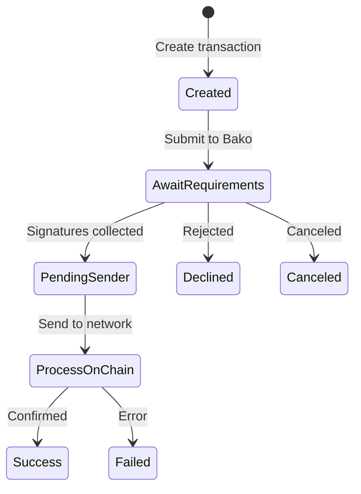

# Transactions Overview

Understanding the transaction lifecycle in Bako Safe multi-signature vaults.

## Transaction Lifecycle



## Transaction Status

| Status | Value | Description |
|--------|-------|-------------|
| `AWAIT_REQUIREMENTS` | `await_requirements` | Waiting for required signatures |
| `PENDING_SENDER` | `pending_sender` | Ready to send, all signatures collected |
| `PROCESS_ON_CHAIN` | `process_on_chain` | Submitted, awaiting confirmation |
| `SUCCESS` | `success` | Completed successfully |
| `DECLINED` | `declined` | Rejected by signers |
| `FAILED` | `failed` | Execution failed |
| `CANCELED` | `canceled` | Canceled before completion |

## Transaction Flow

### 1. Creation

```typescript
const { tx, hashTxId } = await vault.transaction({
  name: 'Payment',
  assets: [{
    assetId: '0x...',
    amount: '1000000',
    to: 'fuel1...'
  }]
});
// Status: AWAIT_REQUIREMENTS
```

### 2. Signature Collection

Signers approve the transaction via:
- Bako Safe web app (safe.bako.global)
- SDK signing methods
- Wallet connections

### 3. Execution

```typescript
// When all signatures collected
const result = await vault.send(tx);
// Status: SUCCESS or FAILED
```

## Transaction Types

```typescript
enum TransactionType {
  BLOB = 'blob',
  SCRIPT = 'script',
  CREATE = 'create',
  UPGRADE = 'upgrade',
  UPLOAD = 'upload',
  DEPOSIT = 'deposit'
}
```

## Transaction Data Structure

### VaultTransaction

```typescript
interface VaultTransaction {
  name?: string;           // Transaction name/description
  assets: ITransferAsset[];  // Assets to transfer
}

interface ITransferAsset {
  assetId: string;   // Asset ID (token address)
  amount: string;    // Amount in base units
  to: string;        // Recipient address
}
```

### ITransactionResume

```typescript
interface ITransactionResume {
  hash: string;              // Transaction hash
  BakoSafeID: string;        // Bako ecosystem ID
  totalSigners: number;      // Total vault signers
  requiredSigners: number;   // Required signatures
  predicate: {
    id: string;
    address: string;
  };
  outputs: ITransferAsset[]; // Transfer details
  status: TransactionStatus;
  witnesses?: string[];      // Collected signatures
  gasUsed?: string;          // Gas consumption
  sendTime?: Date;           // Execution time
}
```

## Quick Example

```typescript
import { BakoProvider, Vault, TransactionStatus } from 'bakosafe';

async function createAndMonitorTransaction() {
  const provider = await BakoProvider.create(networkUrl, { apiToken });
  const vault = await Vault.fromAddress(vaultAddress, provider);

  // Create transaction
  const { tx, hashTxId } = await vault.transaction({
    name: 'Monthly Payment',
    assets: [{
      assetId: ETH_ASSET_ID,
      amount: '1000000000', // 1 ETH
      to: recipientAddress
    }]
  });

  console.log('Transaction created:', hashTxId);

  // Monitor status
  const checkStatus = async () => {
    const txData = await vault.transactionFromHash(hashTxId);

    switch (txData.status) {
      case TransactionStatus.AWAIT_REQUIREMENTS:
        console.log(`Waiting for signatures: ${txData.witnesses.length}/${txData.requiredSigners}`);
        break;
      case TransactionStatus.PENDING_SENDER:
        console.log('Ready to send!');
        const result = await vault.send(tx);
        console.log('Sent:', result.id);
        break;
      case TransactionStatus.SUCCESS:
        console.log('Completed!');
        break;
      case TransactionStatus.FAILED:
        console.log('Failed:', txData.error);
        break;
    }

    return txData.status;
  };

  // Poll until complete
  let status = await checkStatus();
  while (status === TransactionStatus.AWAIT_REQUIREMENTS) {
    await new Promise(r => setTimeout(r, 5000));
    status = await checkStatus();
  }
}
```

## Next Steps

- [Creating Transactions](/sdk/transactions/creating)
- [Signing Transactions](/sdk/transactions/signing)
- [Sending Transactions](/sdk/transactions/sending)
- [Status Monitoring](/sdk/transactions/status)
