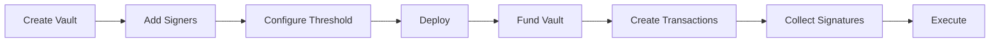

# Vault Overview

A Vault is a multi-signature wallet built on Fuel's predicate system. It requires multiple signatures to authorize transactions, providing enhanced security for digital assets.

## What is a Vault?

A Vault is a smart contract (predicate) that:
- Holds digital assets (tokens, NFTs)
- Requires N-of-M signatures to authorize transactions
- Supports multiple wallet types (Fuel, EVM, WebAuthn)
- Integrates with the Bako Safe ecosystem

## Vault Types

The SDK supports two vault configurations:

| Type | Enum | Description |
|------|------|-------------|
| **BAKO** | `ConfigVaultType.BAKO` | Multi-signature vault with multiple signers |
| **CONNECTOR** | `ConfigVaultType.CONNECTOR` | Single-signer vault for dApp connections |

## Key Concepts

### Signers

Addresses authorized to sign transactions. A vault can have multiple signers.

```typescript
const signers = [
  'fuel1address1...',
  'fuel1address2...',
  'fuel1address3...'
];
```

### Threshold (SIGNATURES_COUNT)

Minimum number of signatures required to execute a transaction.

```typescript
// 2-of-3 multisig: any 2 of 3 signers can approve
const threshold = 2;
const totalSigners = 3;
```

### Predicate Version

The smart contract version used by the vault. Different versions support different features.

```typescript
const version = '0x6ca3bcd759b944b128e9007e2fa75bf700f28c39ce7b34fc241e2c57bf02bdff';
```

## Vault Class Overview

```typescript
class Vault extends Predicate {
  // Properties
  readonly bakoFee: number;
  readonly maxSigners: number;
  readonly configurable: VaultConfigurable;
  readonly predicateVersion: string;

  // Static methods
  static createBakoVault(provider, config, version?): Vault;
  static createConnectorVault(provider, config, version?): Vault;
  static createFromProvider(provider, version?): Vault;
  static async fromAddress(address, provider): Promise<Vault>;

  // Instance methods
  async transaction(params): Promise<TransactionResult>;
  async send(tx): Promise<TransactionResponse>;
  async save(params?): Promise<PredicateResponse>;
  getConfigurable(): VaultConfig;
}
```

## Quick Example

```typescript
import { BakoProvider, Vault } from 'bakosafe';

// Authenticate
const provider = await BakoProvider.create(networkUrl, { apiToken });

// Recover existing vault
const vault = await Vault.fromAddress(vaultAddress, provider);

// Create transaction
const { tx, hashTxId } = await vault.transaction({
  name: 'Payment',
  assets: [{
    assetId: '0x...',
    amount: '1000000',
    to: 'fuel1recipient...'
  }]
});

// Send when signatures are collected
const result = await vault.send(tx);
```

## Vault Workflow



## Security Model

1. **Predicate-based**: Transactions are validated by on-chain logic
2. **Multi-party**: Multiple signatures required for authorization
3. **Non-custodial**: No single party controls the funds
4. **Auditable**: All transactions are on-chain and verifiable

## Next Steps

- [Creating Vaults](/sdk/vault/creating)
- [Recovering Vaults](/sdk/vault/recovering)
- [Configuration Options](/sdk/vault/configuration)
- [Vault Methods](/sdk/vault/methods)
